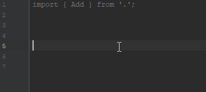

# 🖩 arithmetic-types
> allows you to perform basic arithmetic and bitwise operations on TypeScript numeric types

**DISCLAIMER:** This project is highly experimental and primarily exists to demonstrate what's possible at the limits of TS's type system.  It _seriously strains_ the TS compiler and may even crash your IDE.

# Available Types
| Type | JavaScript "equivalent" |
| ---- | ----------- |
| `Add<A, B>` | `A + B` |
| `Sub<A, B>` | `A - B` |
| `BitShiftLeft<N>` | `N << 1` |
| `BitShiftRight<N>` | `N >> 1` |
| `And<A, B>` | `A & B` (bitwise) |
| `Or<A, B>` | `A ｜ B` (bitwise) |

## Limitations
All these types are restricted to working with positive integers that can be represented with 6 or fewer bits (i.e., 0 - 63).  The size restriction is due only to performance.  I originally planned to support a full byte, but even that was melting the TypeScript compiler; Webstorm was constantly crashing.  With that said, the code would easily scale when the TypeScript compiler can better handle deeply nested types.

I also had a working implementation of multiplication, but also for performance reasons, I had to comment it out.  Check out the source if you're interested.

# Author
Tanner Nielsen <tannerntannern@gmail.com>

[Website](https://tannernielsen.com) | [GitHub](https://github.com/tannerntannern)
